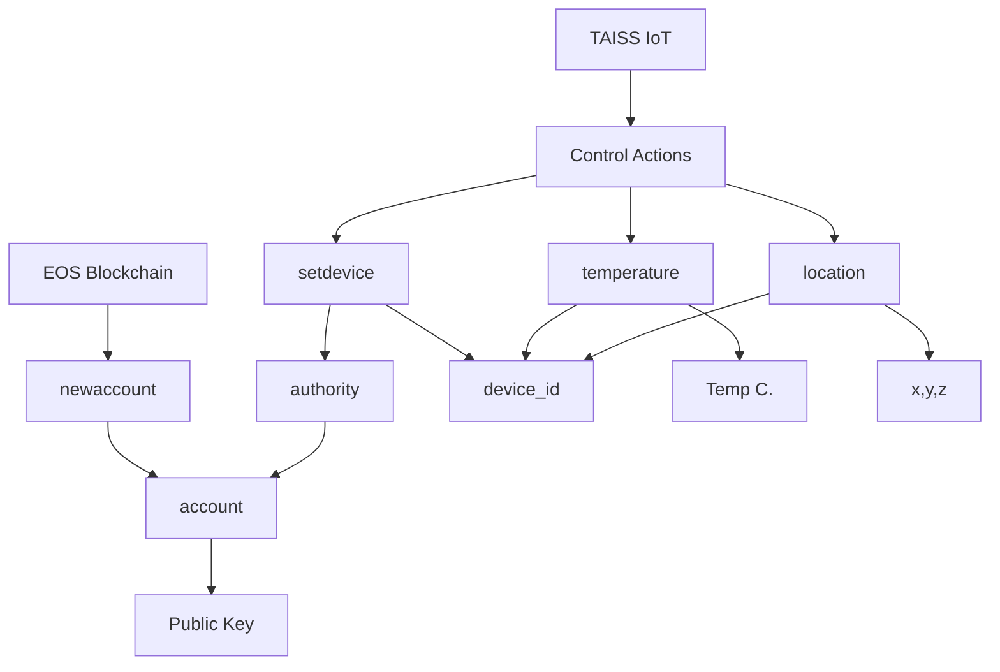

# `TAISS` Project - **IoT** smart contract
[](https://github.com/pinax-network/taiss-contract/blob/main/LICENSE-MIT)
[](https://github.com/pinax-network/taiss-contract/actions/workflows/release.yml)
[](https://github.com/pinax-network/taiss-contract/actions/workflows/ci.yml)

> IoT device interactions to on-chain events.

## Related

- [TAISS Substreams](https://github.com/pinax-network/taiss-substreams)

## Events

| Event | Description |
| --- | --- |
| **Data Collection** | where the device collects data from its sensors and sends it to a server or cloud for further analysis.
| **Status Updates** | where the device sends information about its current status or state, such as battery life or connectivity.
| **Control Actions** | where the device receives a command from a user or server to perform an action, such as turning on a light or unlocking a door.

## Diagram



## Payload `JSON` Format

Here are some JSON examples of payloads for each of these actions:

#### Temperature

```json
{
  "device_id": 901536379396317224,
  "temperature": 25.5
}
```

#### Location

```json
{
  "device_id": 901536379396317224,
  "x": 45.4035,
  "y": -71.8938,
  "z": 0
}
```

## TABLE `devices`

### params

- `{uint64_t} device_id` - (primary key) IoT Device ID
- `{name} authority` - IoT Device Authority
- `{string} transmitter_signature` - IoT Device Transmitter Signature
- `{string} receiver_signature` - IoT Device Receiver Signature
- `{vector<float>} location` - IoT Device Location (x, y, z)
- `{float} [temperature]` - IoT Device Temperature
- `{time_point_sec} [timestamp]` - IoT Device Timestamp
- `{uint64_t} nonce` - IoT Device Nonce

### example

```json
{
    "device_id": 100000,
    "transmitter_signature": "aabbccddeeff/2",
    "receiver_signature": "aabbccddeeff/3",
    "authority": "device.taiss",
    "location": [ 45.4035, -71.8938, 0.0 ],
    "temperature": 37.5,
    "timestamp": "2023-04-19T00:00:00Z",
    "nonce": 10
}
```

## Actions

```bash
# Setup Device
$ cleos push action iot.taiss setdevice '["aabbccddeeff/2", "aabbccddeeff/3", device.taiss]' -p iot.taiss
$ cleos push action iot.taiss deldevice '[901536379396317224]' -p iot.taiss

# Temperature
$ cleos push action iot.taiss temperature '[901536379396317224, 25.5]' -p device.taiss

# Location
$ cleos push action iot.taiss location '[901536379396317224, 45.4035, -71.8938, 0.0]' -p device.taiss
```
