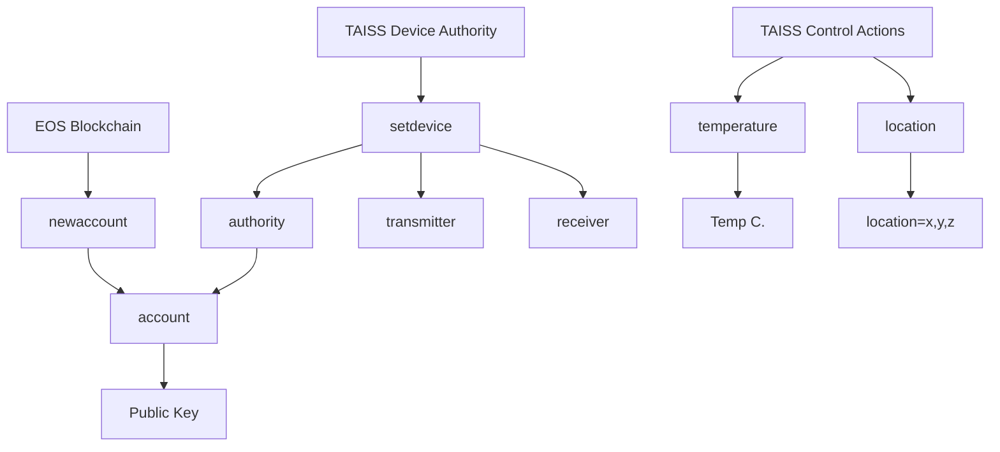

# `TAISS` Project - **IoT** smart contract
[](https://github.com/pinax-network/taiss-contract/blob/main/LICENSE-MIT)
[](https://github.com/pinax-network/taiss-contract/actions/workflows/release.yml)
[](https://github.com/pinax-network/taiss-contract/actions/workflows/ci.yml)

> IoT device interactions to on-chain events.

## Related

- [TAISS Substreams](https://github.com/pinax-network/taiss-substreams)

## Events

| Event | Description |
| --- | --- |
| **Data Collection** | where the device collects data from its sensors and sends it to a server or cloud for further analysis.
| **Status Updates** | where the device sends information about its current status or state, such as battery life or connectivity.
| **Control Actions** | where the device receives a command from a user or server to perform an action, such as turning on a light or unlocking a door.

## Diagram



## Payload `JSON` Format

Here are some JSON examples of payloads for each of these actions:

#### Temperature

```json
{
  "transmitter": "aabbccddeeff/2",
  "receiver": "aabbccddeeff/3",
  "temperature": 25.5
}
```

#### Location

```json
{
  "transmitter": "aabbccddeeff/2",
  "receiver": "aabbccddeeff/3",
  "location": [45.4035, -71.8938, 0]
}
```

## TABLE `devices`

### params

- `{uint64_t} device_id` - (primary key) IoT Device ID
- `{name} type` - IoT Device Type (ex: transmitter, receiver)
- `{string} signature` - IoT Device Signature
- `{name} authority` - IoT Device Authority
- `{time_point_sec} [timestamp]` - IoT Device Timestamp
- `{uint64_t} nonce` - IoT Device Nonce

### example

```json
{
    "device_id": 100000,
    "type": "transmitter",
    "signature": "aabbccddeeff/2",
    "authority": "r.1.taiss",
    "timestamp": "2023-04-19T00:00:00Z",
    "nonce": 10
}
```

## Actions

```bash
# Setup Device
$ cleos push action iot.taiss setdevice '["aabbccddeeff/2", "transmitter", device.taiss]' -p iot.taiss
$ cleos push action iot.taiss setdevice '["aabbccddeeff/3", "receiver", device.taiss]' -p iot.taiss

# Temperature
$ cleos push action iot.taiss temperature '["aabbccddeeff/2", "aabbccddeeff/3", 25.5]' -p device.taiss

# Location
$ cleos push action iot.taiss location '["aabbccddeeff/2", "aabbccddeeff/3", [45.4035, -71.8938, 0.0]]' -p device.taiss

# Delete Device
$ cleos push action iot.taiss deldevice '["aabbccddeeff/2"]' -p iot.taiss
```
